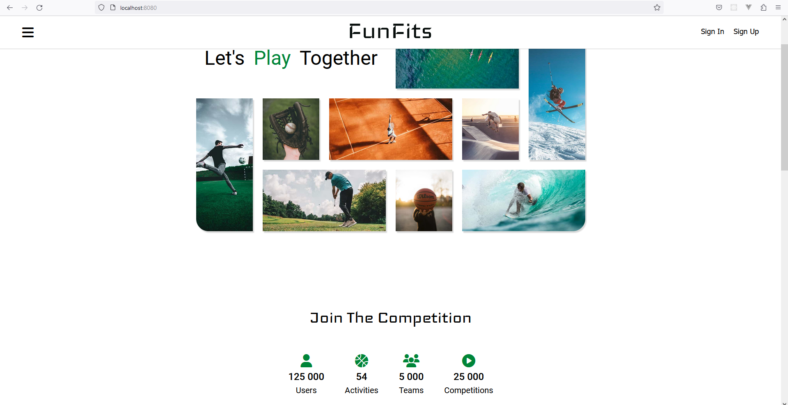
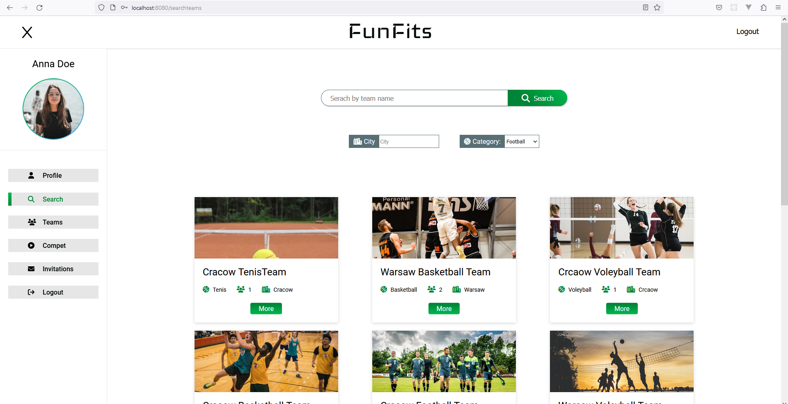

# FunFits

This is a web application project built with PHP, that empowers users to create and manage their own sport teams while providing a space for friendly competition with other teams. The application allows users to create new teams, join existing teams, and organize games between teams.


It utilizes:  
- PHP 7.4.1
- JavaScript
- HTML
- CSS
- SQL
- PostgreSQL
- Docker
- MVC Architecture
- Design Patterns


FunFits aims to facilitate the formation of sport teams, foster friendly competition, and create a thriving community of sports enthusiasts. Whether users are looking to create their own team, join an existing one, or challenge other teams to thrilling matches, this application provides a comprehensive platform to meet their needs.

## Features

- Authentication: Users can create new accounts and gain access to the various functionalities offered by the platform.
-   User Profiles: Each user has a personal profile that displays their name , surname , email, phone number. User can change personal data very easliy by filling simple form .
- Team Creation: Users can create their own sport teams by providing essential details such as team name, sport type, and team description. This enables users to form their desired teams and attract fellow enthusiasts to join.
- Team Joining: Individuals who are passionate about sports can search and browse existing teams based on sport type, location, or team name. They can then send join requests to the teams of their choice, allowing them to become part of a team and collaborate with other like-minded individuals.
- Team Challenges: Teams have the ability to challenge other registered teams to friendly matches or competitions. This feature fosters healthy competition and encourages teams to test their skills against others, enhancing the overall spirit of the application.
- Game history: Each user has a personal page that displays their game history.


###  Prototype in Figma
The frontend prototype was developed using Figma. 


###  Application Views

**Home Page**


**Sign Up Page**


**Search Page**


**Teams Board**


##  Database
The project utilizes a PostgreSQL database. The repository contains two files:
- db.dump.sql - contains a database dump.
- database.sql - contains the necessary SQL code to create the database.

**ERD Diagram**


##  UML


**Models**


**Controllers**


**Repositories**


**Database and Routing**


## Installation

To run this project locally, follow these steps:

1. Clone the repository: `git clone https://github.com/JBR-Sapeta/PHP-WdPAI.git`
2. Change to the project directory.
3. Create config.php file in root directory.
4. In config.php add following fields and enter data for your dtabase.
    - const USERNAME = 'postgres';
    - const PASSWORD = 'somepassword';
    - const HOST = 'database-host';
    - const DATABASE = 'database-name';
    - const PORT = 'database-port';
5. In root directory you can find databse dump - db.dump.sql.
6. Restore database. 
3. Ensure that Docker is installed on your local machine. 
4. Build docker image.
```
docker-compose build
```
6. Start the local development server: 
```
docker-compose up.
```
6. Turn off the local development server: 
```
docker-compose stop
```

## Usage

1. Open your web browser and navigate to `http://localhost:8000`


